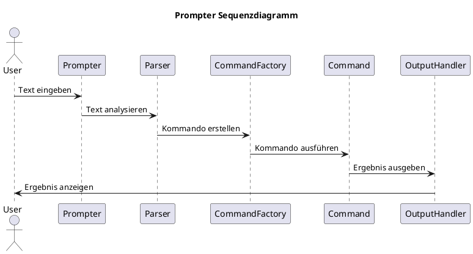

```plantuml
@startuml
title Prompter Sequenzdiagramm

actor User

User -> Prompter : Text eingeben
Prompter -> Parser : Text analysieren
Parser -> CommandFactory : Kommando erstellen
CommandFactory -> Command : Kommando ausführen
Command -> OutputHandler : Ergebnis ausgeben
OutputHandler -> User : Ergebnis anzeigen

@enduml
```
Eingabe c(chat), e(erkl.Code), f(Frage), p(prü), t(Unittest), u(E->D), x